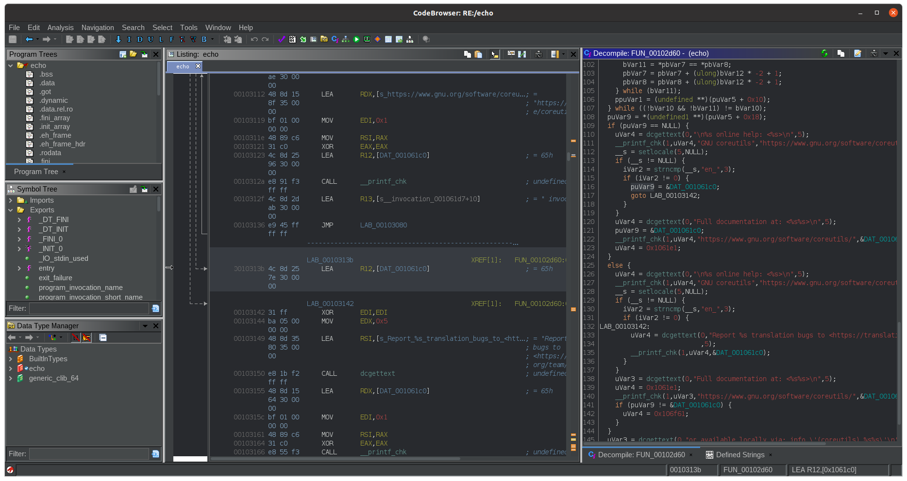

# ghidra-dark

[](https://github.com/NationalSecurityAgency/ghidra/releases)
[](https://www.python.org/downloads/release/python-360/)

ghidra-dark provides a simple to use script to install the FlatLaf dark theme, custom colors for disassembly/decompilation in Ghidra, and some other helpful settings. A script is also provided for uninstallation. The scripts support all public builds through version 10.1 on Windows, Linux, and macOS.

## Install

```
$ python3 install.py
```

If installing as root (e.g. `sudo`), the user to install for may need to be specified:

```
$ sudo python3 install.py -u [user]
```



## Uninstall

```
$ python3 uninstall.py
```
